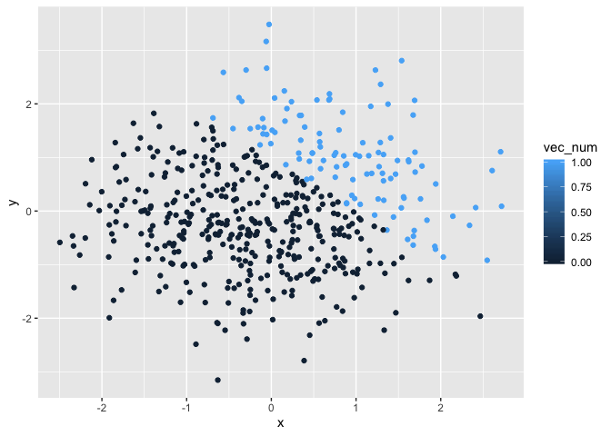
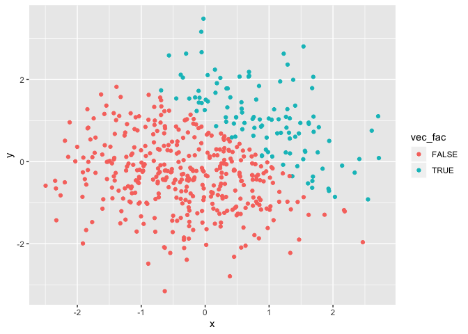

p8105\_hw1\_Ec3342
================
Ekta Chaudhary
19/09/2019

# Question 1

## Creating a Data Frame:

\#Here’s the first **code chunk** that creates a data frame called
first\_df comprised of a random sample named norm\_samp of size 8 from a
*standard normal distribution*, a logical vector named vec\_log
indicating whether elements of the sample are greater than 0, a
character vector named vec\_char of length 8 and a factor vector named
vec\_factor of length 8, with 3 different factor
    levels.

``` r
library(tidyverse)
```

    ## ── Attaching packages ────────────────────────────────────────────────────────────── tidyverse 1.2.1 ──

    ## ✔ ggplot2 3.2.1     ✔ purrr   0.3.2
    ## ✔ tibble  2.1.3     ✔ dplyr   0.8.3
    ## ✔ tidyr   0.8.3     ✔ stringr 1.4.0
    ## ✔ readr   1.3.1     ✔ forcats 0.4.0

    ## ── Conflicts ───────────────────────────────────────────────────────────────── tidyverse_conflicts() ──
    ## ✖ dplyr::filter() masks stats::filter()
    ## ✖ dplyr::lag()    masks stats::lag()

``` r
first_df = tibble(
  norm_samp = rnorm(8),
  vec_log = norm_samp > 0,
  vec_char = c("1","2","3","4","5","6","7","8"),
  vec_factor = factor(c("1","2","3","1","2","3","1","2")),
)
mean(pull(first_df,norm_samp)) 
```

    ## [1] 0.05537915

``` r
mean(pull(first_df,vec_log))
```

    ## [1] 0.75

``` r
mean(pull(first_df,vec_char))
```

    ## Warning in mean.default(pull(first_df, vec_char)): argument is not numeric
    ## or logical: returning NA

    ## [1] NA

``` r
mean(pull(first_df,vec_factor))
```

    ## Warning in mean.default(pull(first_df, vec_factor)): argument is not
    ## numeric or logical: returning NA

    ## [1] NA

\#After creating the data frame, I tried taking the mean of each
variable in the data frame. I got the mean of the random sample
(norm\_samp) and the logical vector (vec\_log).However, when I tried
taking the mean of the character vector (vec\_char) and the factor
vector (vec\_factor), I got an error saying the argument is not numeric
or logical:returning N/A.

\#Now writing the code to apply the **as.numeric** function to the
logical, character, and factor variables. Hiding the output by giving
**eval = FALSE** in the code chunk. After applying the as.numeric
function, the logical vector, character vector and the factor vector
gets converted to numeric because as.numeric will return the numeric
codes that correspond to the logical vector, character vector and factor
vector. If we try taking the mean after this conversion, we no longer
get an error. Therefore, applying as.numeric function allows us to take
the mean of each variable in our dataframe, first\_df.

``` r
as.numeric(pull(first_df,vec_log))
as.numeric(pull(first_df,vec_char))
as.numeric(pull(first_df,vec_factor))

mean(as.numeric(pull(first_df,vec_log)))
mean(as.numeric(pull(first_df,vec_char)))
mean(as.numeric(pull(first_df,vec_factor)))
```

## Second code chunk

\#Here’s the second **code chunk** that is Converting the logical vector
(vec\_log) to numeric using the **as.numeric** function and then
multiplying the result with the random sample(norm\_samp). Converting
the logical vector (vec\_log) to factor vector using the **as.factor**
function and then trying to multiply the result with the random
sample(norm\_samp). On doing so, I got an error here saying ’\*’ is not
meaningful for factors. Converting the logical vector to a factor vector
using as.factor and then converted the result to numeric using
as.numeric; followed by multiplying the result with the random sample.On
doing so,I didn’t get any error because I first converted the factor
vector into numeric and then multiplied that with the random
    sample.

``` r
as.numeric(pull(first_df,vec_log))*(pull(first_df,norm_samp))
```

    ## [1] 0.00000000 0.57756104 0.15233551 0.93073594 0.80882702 0.00000000
    ## [7] 0.39965871 0.09491485

``` r
as.factor(pull(first_df,vec_log))*(pull(first_df,norm_samp))
```

    ## Warning in Ops.factor(as.factor(pull(first_df, vec_log)), (pull(first_df, :
    ## '*' not meaningful for factors

    ## [1] NA NA NA NA NA NA NA NA

``` r
as.numeric(as.factor(pull(first_df,vec_log)))*(pull(first_df,norm_samp))
```

    ## [1] -1.9041856  1.1551221  0.3046710  1.8614719  1.6176540 -0.6168143
    ## [7]  0.7993174  0.1898297

# Question 2

## Creating a data frame

\#Creating a data frame named second\_df comprised of: x which is a
random sample of size 500 from a standard Normal distribution, y which
is a random sample of size 500 from a standard Normal distribution, A
logical vector (vec\_log2) indicating whether x + y \> 1, a numeric
vector (vec\_num), created by coercing the above logical vector and a
factor vector(vec\_fac) created by coercing the above logical vector

``` r
library(tidyverse)

second_df = tibble(
  x = rnorm(500),
  y = rnorm(500),
  vec_log2 = x + y > 1,
vec_num = as.numeric(vec_log2),
vec_fac = as.factor(vec_log2)
)
```

## Description of the dataframe

  - The size of the dataframe is 500 and the number of columns are 5
  - The mean of x is -0.0051375
  - The median of x is 0.0135249
  - The standard deviation of x is 0.9410424
  - The proportion of cases for which x + y \> 1 is 0.24

## Scatterplot

\#Creating a scatterplot of y vs x that color points using the logical
variable, a second scatterplot that color points using the numeric
variables, and a third scatterplot that color plots using the factor
variables.

``` r
ggplot(second_df, aes(x = x, y = y, color = vec_log2)) + geom_point() 
```

<!-- -->

``` r
ggplot(second_df, aes(x = x, y = y, color = vec_num)) + geom_point() 
```

<!-- -->

``` r
ggplot(second_df, aes(x = x, y = y, color = vec_fac)) + geom_point() 
```

<!-- -->

\#The first scatterplot that color points using the logical variable has
two colors: Red represents False and Turquiose represents True. The
second scatterplot that color points using the numeric variable has two
colors: Light blue represents larger numbers and dark blue represents
smaller numbers. The third scatterplot that color points using the
factor variable has two colors: Red represents False and Turquiose
represents True.

\#Exporting the first scatterplot to my project
directory.

``` r
ggsave("First_plot.pdf",height = 6, width = 8, plot = ggplot(second_df, aes(x = x, y = y, color = vec_log2)) + geom_point())
```
